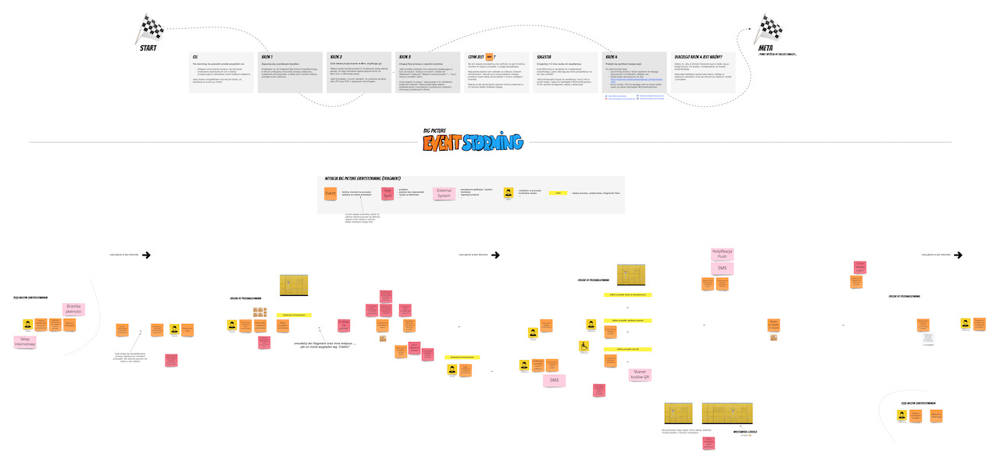

# Domain Explorers

# Spis treści

1. [O repozytorium](#o-repozytorium)
2. [Analiza domeny](#analiza-domeny)  
   2.1 [Big Picture EventStorming](#big-picture-eventstorming)  
   

## O repozytorium

Ten projekt stanowi zapis analizy, modelowania oraz implementacji w ramach [Domain Explorers](https://explorers.bettersoftwaredesign.pl). Znajdziesz tutaj zarówno artefakty wynikowe poszczególnych sesji EventStormingu, modelowania, jak i (docelowo) powstałą na tej bazie implementację.

## Analiza domeny

### Big Picture EventStorming

#### Wersja początkowa

Punktem wyjścia do rozpoznania domeny jest board dostępny w ramach Domain Explorers. Opisuje on wysokopoziomy przebieg procesów załadunku oraz rozładunku skrzynkomatu, a także proces odbioru przesyłki przez odbiorcę.

Aby pobrać pełną wersję boarda, kliknij [tutaj](assets/images/big-picture-init.jpg). 

#### Wersja finalna

TBD
